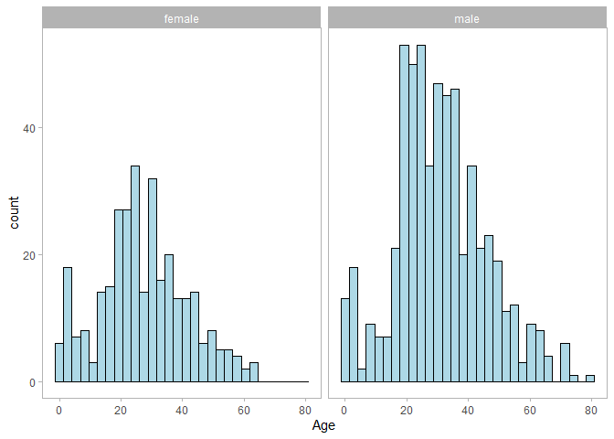

-   [Introduction](#introduction)
    -   [Data Dictionary](#data-dictionary)
-   [Load Libraries and Initial Data
    Preparation](#load-libraries-and-initial-data-preparation)
-   [Missing Data](#missing-data)
    -   [Age Imputation](#age-imputation)
        -   [ANOVA](#anova)
        -   [MICE](#mice)
-   [Exploring Count Data](#exploring-count-data)
-   [Correlation](#correlation)
-   [Model Building](#model-building)

Introduction
============

This exploratory data analysis and model building is based on upon the
Titanic dataset available from kaggle
(<a href="https://www.kaggle.com/c/titanic" class="uri">https://www.kaggle.com/c/titanic</a>).

The objective put fourth by kaggle was to create a model that predicts
which passengers survived the Titanic shipwreck.

There were two datasets used for this analysis (1) the training dataset
and (2) the testing dataset. The training dataset will include the
relevant details of a subset of passengers (n=891), and also includes
their survival status. The testing dataset (n=418) includes the same
characteristics, but does not report the survival status. Thus, the goal
is to use the training dataset to develop the predictive model, using
the observed relationships, and the testing dataset to predict the
survival outcomes of passengers in the testing dataset (i.e., external
validation of the model).This r markdown focuses on the EDA of the
training dataset and development of the two predictive models. The
models were applied to the testing dataset in a seperate script for the
kaggle submissions.

Data Dictionary
---------------

-   survival (outcome of interest–develop models to predict survival
    status)
    -   0 = No, 1 = Yes
-   pclass
    -   Passenger’s ticket class: 1 = 1st, 2 = 2nd, 3 = 3rd
-   sex
    -   male or female
-   Age
    -   Age in years
-   sibsp
    -   Number of siblings or spouses aboard the Titanic
-   parch
    -   Number of parents or children aboard the Titanic
-   ticket
    -   Ticket number
-   fare
    -   Passenger’s fare
-   cabin
    -   Cabin number
-   embarked
    -   Port of embarkation: C = Cherbourg, Q = Queenstown, S =
        Southampton

Load Libraries and Initial Data Preparation
===========================================

Load the required libraries for the analysis

``` r
#Includes data we will be analyzing
library(titanic)
#Includes dplyr, ggplot etc.
library(tidyverse)
#Used for creating a correlation plot between variables
library(corrplot)
#Used for analyzing missing data
library(mice)
#Used for theme and arranging plots
library(ggpubr)
#Levene's test
library(car)
#Used for developing decision tree models
library(rpart)
#The following libraries are used for rendering and visualizing the decision tree
library(rattle)
library(rpart.plot)
library(RColorBrewer)
library(knitr)
# Convert between decimals and percents
library(scales)
library(caret)
library(e1071)
#Used to produce ROC curve
library(pROC)

#Set theme for graphs
theme_set(theme_light())
```

Read in the datasets

``` r
TrainData <- titanic_train
TestData <- titanic_test
#Check the structure of the train data frame
str(TrainData)
```

    ## 'data.frame':    891 obs. of  12 variables:
    ##  $ PassengerId: int  1 2 3 4 5 6 7 8 9 10 ...
    ##  $ Survived   : int  0 1 1 1 0 0 0 0 1 1 ...
    ##  $ Pclass     : int  3 1 3 1 3 3 1 3 3 2 ...
    ##  $ Name       : chr  "Braund, Mr. Owen Harris" "Cumings, Mrs. John Bradley (Florence Briggs Thayer)" "Heikkinen, Miss. Laina" "Futrelle, Mrs. Jacques Heath (Lily May Peel)" ...
    ##  $ Sex        : chr  "male" "female" "female" "female" ...
    ##  $ Age        : num  22 38 26 35 35 NA 54 2 27 14 ...
    ##  $ SibSp      : int  1 1 0 1 0 0 0 3 0 1 ...
    ##  $ Parch      : int  0 0 0 0 0 0 0 1 2 0 ...
    ##  $ Ticket     : chr  "A/5 21171" "PC 17599" "STON/O2. 3101282" "113803" ...
    ##  $ Fare       : num  7.25 71.28 7.92 53.1 8.05 ...
    ##  $ Cabin      : chr  "" "C85" "" "C123" ...
    ##  $ Embarked   : chr  "S" "C" "S" "S" ...

``` r
#Peak at first 10 rows
kable(head(TrainData))
```

|  PassengerId|  Survived|  Pclass| Name                                                | Sex    |  Age|  SibSp|  Parch| Ticket           |     Fare| Cabin | Embarked |
|------------:|---------:|-------:|:----------------------------------------------------|:-------|----:|------:|------:|:-----------------|--------:|:------|:---------|
|            1|         0|       3| Braund, Mr. Owen Harris                             | male   |   22|      1|      0| A/5 21171        |   7.2500|       | S        |
|            2|         1|       1| Cumings, Mrs. John Bradley (Florence Briggs Thayer) | female |   38|      1|      0| PC 17599         |  71.2833| C85   | C        |
|            3|         1|       3| Heikkinen, Miss. Laina                              | female |   26|      0|      0| STON/O2. 3101282 |   7.9250|       | S        |
|            4|         1|       1| Futrelle, Mrs. Jacques Heath (Lily May Peel)        | female |   35|      1|      0| 113803           |  53.1000| C123  | S        |
|            5|         0|       3| Allen, Mr. William Henry                            | male   |   35|      0|      0| 373450           |   8.0500|       | S        |
|            6|         0|       3| Moran, Mr. James                                    | male   |   NA|      0|      0| 330877           |   8.4583|       | Q        |

``` r
#Peak at last 10 rows
kable(tail(TrainData))
```

|     |  PassengerId|  Survived|  Pclass| Name                                     | Sex    |  Age|  SibSp|  Parch| Ticket     |    Fare| Cabin | Embarked |
|-----|------------:|---------:|-------:|:-----------------------------------------|:-------|----:|------:|------:|:-----------|-------:|:------|:---------|
| 886 |          886|         0|       3| Rice, Mrs. William (Margaret Norton)     | female |   39|      0|      5| 382652     |  29.125|       | Q        |
| 887 |          887|         0|       2| Montvila, Rev. Juozas                    | male   |   27|      0|      0| 211536     |  13.000|       | S        |
| 888 |          888|         1|       1| Graham, Miss. Margaret Edith             | female |   19|      0|      0| 112053     |  30.000| B42   | S        |
| 889 |          889|         0|       3| Johnston, Miss. Catherine Helen “Carrie” | female |   NA|      1|      2| W./C. 6607 |  23.450|       | S        |
| 890 |          890|         1|       1| Behr, Mr. Karl Howell                    | male   |   26|      0|      0| 111369     |  30.000| C148  | C        |
| 891 |          891|         0|       3| Dooley, Mr. Patrick                      | male   |   32|      0|      0| 370376     |   7.750|       | Q        |

As observed by checking the structure of the data, sex and embarked are
chr variables that could be converted to factors:

``` r
myCols <- c("Sex","Embarked", "Pclass")
TrainData[,myCols] <- lapply(TrainData[,myCols], function(x) {as.factor(x)})
#check the class of each variable
sapply(TrainData,function(x) {class(x)})
```

    ## PassengerId    Survived      Pclass        Name         Sex         Age 
    ##   "integer"   "integer"    "factor" "character"    "factor"   "numeric" 
    ##       SibSp       Parch      Ticket        Fare       Cabin    Embarked 
    ##   "integer"   "integer" "character"   "numeric" "character"    "factor"

Check the summary of TrainData.

``` r
summary(TrainData)
```

    ##   PassengerId       Survived      Pclass      Name               Sex     
    ##  Min.   :  1.0   Min.   :0.0000   1:216   Length:891         female:314  
    ##  1st Qu.:223.5   1st Qu.:0.0000   2:184   Class :character   male  :577  
    ##  Median :446.0   Median :0.0000   3:491   Mode  :character               
    ##  Mean   :446.0   Mean   :0.3838                                          
    ##  3rd Qu.:668.5   3rd Qu.:1.0000                                          
    ##  Max.   :891.0   Max.   :1.0000                                          
    ##                                                                          
    ##       Age            SibSp           Parch           Ticket         
    ##  Min.   : 0.42   Min.   :0.000   Min.   :0.0000   Length:891        
    ##  1st Qu.:20.12   1st Qu.:0.000   1st Qu.:0.0000   Class :character  
    ##  Median :28.00   Median :0.000   Median :0.0000   Mode  :character  
    ##  Mean   :29.70   Mean   :0.523   Mean   :0.3816                     
    ##  3rd Qu.:38.00   3rd Qu.:1.000   3rd Qu.:0.0000                     
    ##  Max.   :80.00   Max.   :8.000   Max.   :6.0000                     
    ##  NA's   :177                                                        
    ##       Fare           Cabin           Embarked
    ##  Min.   :  0.00   Length:891          :  2   
    ##  1st Qu.:  7.91   Class :character   C:168   
    ##  Median : 14.45   Mode  :character   Q: 77   
    ##  Mean   : 32.20                      S:644   
    ##  3rd Qu.: 31.00                              
    ##  Max.   :512.33                              
    ## 

From the structure presented prior, it is clear the the majority of data
for the variable Cabin is blank. Let’s replace these blank values with
NAs.

``` r
TrainData$Cabin[TrainData$Cabin==""] <- NA
#Check the blank values were correctly changed to NAs
sum(is.na(TrainData$Cabin))
```

    ## [1] 687

``` r
#Calculate % missing for the variable Cabin
paste("The percent of missing data for the variable cabin is: ", percent(sum(is.na(TrainData$Cabin))/length(TrainData$Cabin)))
```

    ## [1] "The percent of missing data for the variable cabin is:  77.1%"

There are also two blank values for the variable Embarked. These blank
values will be replaced with S (Southampton), by far the most common
point of embarkation.

``` r
TrainData$Embarked[TrainData$Embarked == ""] <- "S"
```

Missing Data
============

The missingness of this dataset is assessed by counting the number of
NAs in each column. The variable age has missing data (177 out of 891)
that could be imputted–this will be futher explored in the subsequent
sections.

``` r
missN <- sapply(TrainData, function(x) sum((is.na(x))))
missN <- data.frame(missN)
#Only retain rows where the count of NAs is > 0. drop = FALSE is needed since the dataframe is 1 dimension
missN[missN>0,,drop=FALSE]
```

    ##       missN
    ## Age     177
    ## Cabin   687

Age Imputation
--------------

One simple approach to handle the data imputation would be by using the
mean age, either overall or by subgroups. For instance, how does mean
age differ across Pclass? If there are differences, the mean age for
Pclass 1,2,and 3 could be used to impute missing values.

``` r
#Print the mean, SD, and N for Pclass 1, 2, and 3
TrainData %>%
  group_by(Pclass) %>%
  summarise(mean=mean(Age,na.rm=TRUE), sd = sd(Age,na.rm=TRUE),n=n())
```

    ## # A tibble: 3 x 4
    ##   Pclass  mean    sd     n
    ##   <fct>  <dbl> <dbl> <int>
    ## 1 1       38.2  14.8   216
    ## 2 2       29.9  14.0   184
    ## 3 3       25.1  12.5   491

Boxplots by Pclass are presented below. Passenger class is be negatively
correlated with age. Refer to the section [Correlation](#correlation)
for additional details.

``` r
ggplot(data=TrainData,aes(x=Pclass,y=Age,color=Pclass)) +
  geom_boxplot() +
  stat_summary(fun.y=mean,shape=1,col='black',geom='point',na.rm = TRUE)+
  labs(x="Passenger Class")+
  theme(panel.grid.major.y = element_blank(),
  panel.grid.minor.y = element_blank(),
  panel.grid.major.x = element_blank(),
  panel.grid.minor.x = element_blank())
```


### ANOVA

We can compare the means for the three groups using one-way ANOVA.

*H*<sub>0</sub> : *μ*<sub>1</sub> = *μ*<sub>2</sub> = *μ*<sub>3</sub> vs
*H*<sub>*a*</sub>: at least one mean is different.

Here we will determine whether there is any significant difference
between the average ages of passengers in the three classes (first,
second, and third class)

``` r
#Conduct one-way anova test and save it to the variable my_aov
my_aov <- aov(Age ~ Pclass, data=TrainData)
#Print summary of one-way anova test
summary(my_aov)
```

    ##              Df Sum Sq Mean Sq F value Pr(>F)    
    ## Pclass        2  20930   10465   57.44 <2e-16 ***
    ## Residuals   711 129527     182                   
    ## ---
    ## Signif. codes:  0 '***' 0.001 '**' 0.01 '*' 0.05 '.' 0.1 ' ' 1
    ## 177 observations deleted due to missingness

Note that the output from summary includes the column Pr(\>F) which is
the p-value of the test. As the p-value is less than the significance
level of 0.05, we can reject the null hypothesis in favor of the
alternative hypothesis; that is, we conclude that at least one mean is
different from the other means.

Conduct multiple pairwise-comparison between the means of groups using
Tukey HSD. From the output below, the difference between all the
passenger classes is significant, with adjusted p-values \<0.05. The
Tukey pairwise comparisons suggest that all the means are different.

``` r
TukeyHSD(my_aov)
```

    ##   Tukey multiple comparisons of means
    ##     95% family-wise confidence level
    ## 
    ## Fit: aov(formula = Age ~ Pclass, data = TrainData)
    ## 
    ## $Pclass
    ##           diff        lwr        upr     p adj
    ## 2-1  -8.355811 -11.704133  -5.007489 0.0000000
    ## 3-1 -13.092821 -15.962198 -10.223445 0.0000000
    ## 3-2  -4.737010  -7.676279  -1.797742 0.0004884

Check the homogeneity of variance assumption for the ANOVA model.

We can see that from our three factor levels, 12.5 is the smallest and
14.8 is the lasrgest SD. Furthermore, our samples sizes are quite
different, so we cannot use the informal check of the ratio of two
standard sample standard deviaitons (see
<a href="https://newonlinecourses.science.psu.edu/stat500/lesson/7/7.3/7.3.1/7.3.1.1" class="uri">https://newonlinecourses.science.psu.edu/stat500/lesson/7/7.3/7.3.1/7.3.1.1</a>).

``` r
TrainData %>%
  select(Age, Pclass) %>%
  group_by(Pclass) %>%
  summarize(mean = mean(Age, na.rm = T), SDs = sd(Age, na.rm = T), Counts = n())
```

    ## # A tibble: 3 x 4
    ##   Pclass  mean   SDs Counts
    ##   <fct>  <dbl> <dbl>  <int>
    ## 1 1       38.2  14.8    216
    ## 2 2       29.9  14.0    184
    ## 3 3       25.1  12.5    491

For the residual vs fits plot, certain points are detected as outliers
(852,117,631).

Levene’s test is also used to assess the equality of variances; it tests
the null hypothesis that the population variances are equal. Note that
the p-value is less than 0.05, the significance level, and thus the null
hypothesis is rejected–it is concluded that there is a difference
between the variances in the population.

``` r
#Print the residuals vs fits plot. 
plot(my_aov, 1)
```


``` r
#Use Levene's test to assess the equality of variances.
leveneTest(Age ~ Pclass, data = TrainData)
```

    ## Levene's Test for Homogeneity of Variance (center = median)
    ##        Df F value   Pr(>F)   
    ## group   2  5.6202 0.003787 **
    ##       711                    
    ## ---
    ## Signif. codes:  0 '***' 0.001 '**' 0.01 '*' 0.05 '.' 0.1 ' ' 1

Since the homogeneity of variance assumption has been violated, we can
consider Welch’s one-way ANOVA. The conclusions are the same as the
classic one-way ANOVA, presented above.

``` r
#Welch's ANOVA--no assumption of equal variances
oneway.test(Age~Pclass, data=TrainData)
```

    ## 
    ##  One-way analysis of means (not assuming equal variances)
    ## 
    ## data:  Age and Pclass
    ## F = 53.355, num df = 2.00, denom df = 359.44, p-value < 2.2e-16

``` r
#Pairwise t-tests with no assumption of equal variances
pairwise.t.test(TrainData$Age, TrainData$Pclass ,p.adjust.method = "BH",pool.sd = FALSE)
```

    ## 
    ##  Pairwise comparisons using t tests with non-pooled SD 
    ## 
    ## data:  TrainData$Age and TrainData$Pclass 
    ## 
    ##   1       2      
    ## 2 1.1e-07 -      
    ## 3 < 2e-16 0.00019
    ## 
    ## P value adjustment method: BH

Check the normality assumption for an ANOVA model. Based on the Q-Q plot
and Shapiro-Wilk test, the normality assumption is not met.The
null-hypothesis of the Shapiro-Wilk test is that the population is
normally distributed.Based on the calculated p-value and alpha = 0.05,
the null hypothesis is rejected and there is evidence that the data
tested are not normally distributed.

``` r
#Q-Q plot
plot(my_aov, 2)
```


``` r
# Extract the residuals
aov_residuals <- residuals(object = my_aov)
# Run Shapiro-Wilk test.
shapiro.test(x = aov_residuals)
```

    ## 
    ##  Shapiro-Wilk normality test
    ## 
    ## data:  aov_residuals
    ## W = 0.99146, p-value = 0.0003856

Since the ANOVA assumptions have been violated, a non-parametric
alternative to one-way ANOVA, Kruskal-Wallis rank sum test, is
implemented. The conclusion is the same before: there are significant
differences in the average age between all passenger classes.

``` r
kruskal.test(Age ~ Pclass, data = TrainData)
```

    ## 
    ##  Kruskal-Wallis rank sum test
    ## 
    ## data:  Age by Pclass
    ## Kruskal-Wallis chi-squared = 95.995, df = 2, p-value < 2.2e-16

``` r
pairwise.wilcox.test(TrainData$Age, TrainData$Pclass,
                 p.adjust.method = "BH")
```

    ## 
    ##  Pairwise comparisons using Wilcoxon rank sum test 
    ## 
    ## data:  TrainData$Age and TrainData$Pclass 
    ## 
    ##   1       2      
    ## 2 5.3e-07 -      
    ## 3 < 2e-16 2.2e-05
    ## 
    ## P value adjustment method: BH

### MICE

Next, the MICE package is used to assess and impute missing data.
Multiple imputation will be implemented as opposed to the simple
mean-based approach explored above. As observed prior, we have two
variables with missing values. md.pattern() is used to ascertain a
better understanding of the pattern of missing data. 177 missing values
for age and 687 missing values for cabin.

``` r
md.pattern(TrainData)
```


    ##     PassengerId Survived Pclass Name Sex SibSp Parch Ticket Fare Embarked
    ## 185           1        1      1    1   1     1     1      1    1        1
    ## 529           1        1      1    1   1     1     1      1    1        1
    ## 19            1        1      1    1   1     1     1      1    1        1
    ## 158           1        1      1    1   1     1     1      1    1        1
    ##               0        0      0    0   0     0     0      0    0        0
    ##     Age Cabin    
    ## 185   1     1   0
    ## 529   1     0   1
    ## 19    0     1   1
    ## 158   0     0   2
    ##     177   687 864

``` r
#Dropping cabin from the analysis due to the large % of missing data 687/891 = 77%
TrainData <-
  TrainData %>%
  select(-Cabin)
```

Adjust the TrainData to prepare for data imputation

``` r
#Remove char variables that won't be needed for imputation and assign to a new dataframe, TrainData_Impute
TrainData_Impute <- TrainData[,!(names(TrainData) %in% c("Name","Ticket"))]
```

The mice() function takes care of the imputing process. m refers to the
number of imputted datasets–set to the default of 5.

``` r
myMice <- mice(TrainData_Impute,m=5,seed=400)
```

    ## 
    ##  iter imp variable
    ##   1   1  Age
    ##   1   2  Age
    ##   1   3  Age
    ##   1   4  Age
    ##   1   5  Age
    ##   2   1  Age
    ##   2   2  Age
    ##   2   3  Age
    ##   2   4  Age
    ##   2   5  Age
    ##   3   1  Age
    ##   3   2  Age
    ##   3   3  Age
    ##   3   4  Age
    ##   3   5  Age
    ##   4   1  Age
    ##   4   2  Age
    ##   4   3  Age
    ##   4   4  Age
    ##   4   5  Age
    ##   5   1  Age
    ##   5   2  Age
    ##   5   3  Age
    ##   5   4  Age
    ##   5   5  Age

``` r
#Check summary
summary(myMice)
```

    ## Class: mids
    ## Number of multiple imputations:  5 
    ## Imputation methods:
    ## PassengerId    Survived      Pclass         Sex         Age       SibSp 
    ##          ""          ""          ""          ""       "pmm"          "" 
    ##       Parch        Fare    Embarked 
    ##          ""          ""          "" 
    ## PredictorMatrix:
    ##             PassengerId Survived Pclass Sex Age SibSp Parch Fare Embarked
    ## PassengerId           0        1      1   1   1     1     1    1        1
    ## Survived              1        0      1   1   1     1     1    1        1
    ## Pclass                1        1      0   1   1     1     1    1        1
    ## Sex                   1        1      1   0   1     1     1    1        1
    ## Age                   1        1      1   1   0     1     1    1        1
    ## SibSp                 1        1      1   1   1     0     1    1        1
    ## Number of logged events:  25 
    ##   it im dep meth       out
    ## 1  1  1 Age  pmm EmbarkedS
    ## 2  1  2 Age  pmm EmbarkedS
    ## 3  1  3 Age  pmm EmbarkedS
    ## 4  1  4 Age  pmm EmbarkedS
    ## 5  1  5 Age  pmm EmbarkedS
    ## 6  2  1 Age  pmm EmbarkedS

Get the completed dataset using complete(). Use the first of the 5
imputted datasets.

``` r
TrainData_Impute <- complete(myMice,1)
```

Compare the original Age (excluding missing values) vs Age (including
imputed values)

``` r
plot1 <- TrainData%>%
  ggplot(aes(x=Age))+
  geom_histogram(aes(y=..density..), color="black", fill="lightblue")+
  geom_density(alpha=.2, fill="#FF6666")+
  theme(panel.grid.major.y = element_blank(),
  panel.grid.minor.y = element_blank(),
  panel.grid.major.x = element_blank(),
  panel.grid.minor.x = element_blank())
plot2 <- TrainData_Impute%>%
  ggplot(aes(x=Age))+
  geom_histogram(aes(y=..density..), color="black", fill="lightblue")+
  geom_density(alpha=.2, fill="#FF6666")+
  theme(panel.grid.major.y = element_blank(),
  panel.grid.minor.y = element_blank(),
  panel.grid.major.x = element_blank(),
  panel.grid.minor.x = element_blank())

ggarrange(plot1,plot2,labels=c("A","B"),ncol=2,nrow=1)
```


The age distribution (including imputted values) looks quite similar to
the original.

``` r
#Replace Age with imputed Age
TrainData$Age <- TrainData_Impute$Age
```

Exploring Count Data
====================

For Survived, 1 indicates yes and 0 indicates no. As discussed in the
[Introduction](#introduction), survival is the main outcome of interest
that we are trying to predict. From the dataset, it was calculated that
549 passengers (61.6%) died and 342 (38.4%) died.

The second count is a breakdown of the gender distribution of
passengers–the majority of passengers were male.

The third count is stratified by survival status and sex. 68% of females
survived, whereas only 32% of males survived.

``` r
TrainData %>%
  group_by(Survived) %>%
  summarise(n=n())%>%
  mutate(percent=n/sum(n))
```

    ## # A tibble: 2 x 3
    ##   Survived     n percent
    ##      <int> <int>   <dbl>
    ## 1        0   549   0.616
    ## 2        1   342   0.384

``` r
TrainData %>%
  group_by(Sex) %>%
  summarise (n=n())%>%
  mutate(percent=n/sum(n))
```

    ## # A tibble: 2 x 3
    ##   Sex        n percent
    ##   <fct>  <int>   <dbl>
    ## 1 female   314   0.352
    ## 2 male     577   0.648

``` r
TrainData %>%
  group_by(Survived,Sex) %>%
  summarise (n=n())%>%
  mutate(percent=n/sum(n))
```

    ## # A tibble: 4 x 4
    ## # Groups:   Survived [2]
    ##   Survived Sex        n percent
    ##      <int> <fct>  <int>   <dbl>
    ## 1        0 female    81   0.148
    ## 2        0 male     468   0.852
    ## 3        1 female   233   0.681
    ## 4        1 male     109   0.319

The variable Pclass describes the passenger’s travel “class” and is a
three-level, ordered categorical variable, where 1, 2, and 3 signify
first, second, and third class, respectively. Approx half of the
passengers were travelling third class

``` r
#Clearly, the highest count is 3rd class and death
TrainData %>%
  count(Survived, Pclass, sort=T)
```

    ## # A tibble: 6 x 3
    ##   Survived Pclass     n
    ##      <int> <fct>  <int>
    ## 1        0 3        372
    ## 2        1 1        136
    ## 3        1 3        119
    ## 4        0 2         97
    ## 5        1 2         87
    ## 6        0 1         80

``` r
TrainData %>%
  ggplot(aes(x=Pclass, fill=factor(Survived),color=factor(Survived))) +
  geom_bar(alpha=0.4) +
  xlab("Passenger Class") +
  ylab("Count") +
  labs(fill="Survived")+
  theme(panel.grid.major.y = element_blank(),
  panel.grid.minor.y = element_blank(),
  panel.grid.major.x = element_blank(),
  panel.grid.minor.x = element_blank())
```


The variables Parch and SibSp are count variables, counting the number
of parents/children and siblings/spouses aboard. Most passengers
traveled alone.

``` r
TrainData %>%
  ggplot(aes(x=Parch,fill=factor(Parch),color=factor(Parch)))+
  geom_bar(alpha=0.4)+
  xlab("# of Parents/Children")+
  ylab("Count")+
  theme(legend.position="none")+
  theme(panel.grid.major.y = element_blank(),
  panel.grid.minor.y = element_blank(),
  panel.grid.major.x = element_blank(),
  panel.grid.minor.x = element_blank())
```


``` r
TrainData %>%
  ggplot(aes(x=SibSp,fill=factor(SibSp),color=factor(SibSp)))+
  geom_bar(alpha=0.4)+
  xlab("# of Siblings/Spouses")+
  ylab("Count")+
  theme(legend.position="none")+
  theme(panel.grid.major.y = element_blank(),
  panel.grid.minor.y = element_blank(),
  panel.grid.major.x = element_blank(),
  panel.grid.minor.x = element_blank())
```


The points of embarkation were C = Cherbourg; Q = Queenstown; S =
Southampton. The majority of passengers embarked at Southampton.

``` r
TrainData %>%
  ggplot(aes(x=Embarked,fill=factor(Survived),color=factor(Survived)))+
  geom_bar(alpha=0.4)+
  theme(panel.grid.major.y = element_blank(),
  panel.grid.minor.y = element_blank(),
  panel.grid.major.x = element_blank(),
  panel.grid.minor.x = element_blank())
```


The age distributions (including imputted values) for males and females
are presented below. All senior passengers aged 65 years+ were male.

``` r
TrainData %>%
  ggplot(aes(x=Age))+
  geom_histogram(fill="lightblue",color="black")+
  facet_grid(~Sex)+
  theme(panel.grid.major.y = element_blank(),
  panel.grid.minor.y = element_blank(),
  panel.grid.major.x = element_blank(),
  panel.grid.minor.x = element_blank())
```



``` r
TrainData %>%
  ggplot(aes(x=Age, color=Sex,fill=Sex))+
  geom_density(alpha=0.4)+
  theme(panel.grid.major.y = element_blank(),
  panel.grid.minor.y = element_blank(),
  panel.grid.major.x = element_blank(),
  panel.grid.minor.x = element_blank())
```


The oldest male and female passengers were 80 and 63 years,
respectively.

``` r
TrainData %>%
  select(Age,Sex) %>%
  group_by(Sex) %>%
  summarise(max_age=max(Age), min_age=min(Age)) %>%
  arrange(desc(max_age))
```

    ## # A tibble: 2 x 3
    ##   Sex    max_age min_age
    ##   <fct>    <dbl>   <dbl>
    ## 1 male        80    0.42
    ## 2 female      63    0.75

The age distribution stratified by (1) sex and (2) survival outcome
(yes=1).

``` r
TrainData %>%
  ggplot(aes(x=Age,color=factor(Survived),fill=factor(Survived)))+
  geom_histogram(alpha=0.4)+
  facet_grid(~Sex)+
  theme(panel.grid.major.y = element_blank(),
  panel.grid.minor.y = element_blank(),
  panel.grid.major.x = element_blank(),
  panel.grid.minor.x = element_blank())
```


The relationship between fare and survival.

``` r
TrainData %>%
  ggplot(aes(x=Fare,fill=factor(Survived),color=factor(Survived)))+
  geom_histogram(binwidth=50,alpha=0.4)+
  theme(panel.grid.major.y = element_blank(),
  panel.grid.minor.y = element_blank(),
  panel.grid.major.x = element_blank(),
  panel.grid.minor.x = element_blank())
```


Check to see what data is available from the variable Name

``` r
head(TrainData$Name)
```

    ## [1] "Braund, Mr. Owen Harris"                            
    ## [2] "Cumings, Mrs. John Bradley (Florence Briggs Thayer)"
    ## [3] "Heikkinen, Miss. Laina"                             
    ## [4] "Futrelle, Mrs. Jacques Heath (Lily May Peel)"       
    ## [5] "Allen, Mr. William Henry"                           
    ## [6] "Moran, Mr. James"

Extract title’s using the function grepl. Rare titles were categorized
as “other”

``` r
TrainData <- TrainData %>%
  mutate(Title = case_when(
    grepl("Miss.", Name) ~ "Miss",
    grepl("Master.", Name) ~ "Master",
    grepl("Mrs.", Name) ~ "Mrs",
    grepl("Mr.", Name) ~ "Mr",
    TRUE ~ "Other"))
```

Check the frequency of each title by sex.

``` r
# Frequency of each title by sex
kable(table(TrainData$Sex, TrainData$Title))
```

|        |  Master|  Miss|   Mr|  Mrs|  Other|
|--------|-------:|-----:|----:|----:|------:|
| female |       0|   182|    0|  127|      5|
| male   |      40|     0|  518|    0|     19|

``` r
#Change to factor
TrainData$Title <- as.factor(TrainData$Title)
```

Distribution of title and survival in each passenger class is presented
below. Miss, Master, and Mrs. have higher probabilities of survival,
especially in class 1 and 2.

``` r
TrainData%>%
  ggplot(aes(Title,fill=factor(Survived),color=factor(Survived)))+
  geom_bar(alpha=0.4)+
  facet_wrap(~Pclass)+
  theme(panel.grid.major.y = element_blank(),
  panel.grid.minor.y = element_blank(),
  panel.grid.major.x = element_blank(),
  panel.grid.minor.x = element_blank())
```


``` r
#Box plot of age by Title and Pclass
TrainData%>%
  ggplot(aes(x=Title,y=Age,color=Pclass,fill=Pclass))+
  geom_boxplot(alpha=0.4)+
  theme(panel.grid.major.y = element_blank(),
  panel.grid.minor.y = element_blank(),
  panel.grid.major.x = element_blank(),
  panel.grid.minor.x = element_blank())
```


``` r
#Age distribution for each Title
TrainData %>%
  ggplot(aes(Age,fill=Title))+
  geom_histogram()+
  facet_wrap(~Title)+
  theme(legend.position = "none")+
  theme(panel.grid.major.y = element_blank(),
  panel.grid.minor.y = element_blank(),
  panel.grid.major.x = element_blank(),
  panel.grid.minor.x = element_blank())
```


A chi square test is conducted to assess the relationship between data
that are counts (frequencies) or proportions.  
Null hypothesis: (1) survival and sex and (2) survival and class are
independent. In other words, everyone (irrespective of sex or class) had
the same chance of survival. Here the p-values are quite low, well below
a 5% level, so we would reject the null hypothesis.

``` r
chisq.test(TrainData$Survived, TrainData$Sex)
```

    ## 
    ##  Pearson's Chi-squared test with Yates' continuity correction
    ## 
    ## data:  TrainData$Survived and TrainData$Sex
    ## X-squared = 260.72, df = 1, p-value < 2.2e-16

``` r
chisq.test(TrainData$Survived, TrainData$Pclass)
```

    ## 
    ##  Pearson's Chi-squared test
    ## 
    ## data:  TrainData$Survived and TrainData$Pclass
    ## X-squared = 102.89, df = 2, p-value < 2.2e-16

Similarly, the chi square test is conducted to assess the relationship
between Survived and the derived variable Title.

``` r
chisq.test(TrainData$Survived,TrainData$Title)
```

    ## 
    ##  Pearson's Chi-squared test
    ## 
    ## data:  TrainData$Survived and TrainData$Title
    ## X-squared = 284.35, df = 4, p-value < 2.2e-16

Correlation
===========

First, need to convert factors to numeric/integers.

``` r
TrainData2 <- TrainData %>%
  mutate(Sex=ifelse(Sex == "male",1,0))
TrainData2$Pclass <- as.integer(TrainData2$Pclass)
TrainData2$Title <- as.integer(TrainData2$Title)
```

Calculate correlation matrix and plot. Sex has the strongest correlation
with Survived (-0.54)–they are negatively correlated since Sex is coded
male = 1 and female = 0 and the latter had a much higher probability of
survival. Pclass is also negatively correlated with Survived–that is, as
the passenger class increases, the probability of survival decreases.
Fare is negatively correlated with Pclass and Fare is positively
correlated with Survived–higher the Fare, the higher the probability of
survival.

``` r
#Select variables that are int/numeric data types.
TrainData2 <- TrainData2[,c(2:3,5:8,10,12)]
cor(TrainData2)
```

    ##             Survived      Pclass         Sex         Age       SibSp
    ## Survived  1.00000000 -0.33848104 -0.54335138 -0.09294266 -0.03532250
    ## Pclass   -0.33848104  1.00000000  0.13190049 -0.32645445  0.08308136
    ## Sex      -0.54335138  0.13190049  1.00000000  0.12604199 -0.11463081
    ## Age      -0.09294266 -0.32645445  0.12604199  1.00000000 -0.32930803
    ## SibSp    -0.03532250  0.08308136 -0.11463081 -0.32930803  1.00000000
    ## Parch     0.08162941  0.01844267 -0.24548896 -0.20292171  0.41483770
    ## Fare      0.25730652 -0.54949962 -0.18233283  0.05673680  0.15965104
    ## Title    -0.06017278 -0.18889888  0.04262877  0.44121965 -0.21711585
    ##                Parch        Fare       Title
    ## Survived  0.08162941  0.25730652 -0.06017278
    ## Pclass    0.01844267 -0.54949962 -0.18889888
    ## Sex      -0.24548896 -0.18233283  0.04262877
    ## Age      -0.20292171  0.05673680  0.44121965
    ## SibSp     0.41483770  0.15965104 -0.21711585
    ## Parch     1.00000000  0.21622494 -0.12128344
    ## Fare      0.21622494  1.00000000 -0.01127527
    ## Title    -0.12128344 -0.01127527  1.00000000

``` r
cor_TrainData2 <- cor(TrainData2)
corrplot(cor_TrainData2)
```


Model Building
==============

Now let’s conduct a logistic regression. First, remove variables that
won’t be used in the development of the logistic regression model

``` r
TrainData_sub <-
  TrainData %>%
  select(-PassengerId,-Name,-Ticket)
```

Significant predictors include Pclass, Age, SibSp, Parch, TitleMR, and
TitleOther

``` r
#Fit the model and print the summary
myModel <- glm(Survived ~ .,family=binomial(link="logit"),data=TrainData_sub)
summary(myModel)
```

    ## 
    ## Call:
    ## glm(formula = Survived ~ ., family = binomial(link = "logit"), 
    ##     data = TrainData_sub)
    ## 
    ## Deviance Residuals: 
    ##     Min       1Q   Median       3Q      Max  
    ## -2.3745  -0.5617  -0.3639   0.5334   2.4485  
    ## 
    ## Coefficients:
    ##               Estimate Std. Error z value Pr(>|z|)    
    ## (Intercept)  20.610166 621.646164   0.033 0.973552    
    ## Pclass2      -1.140479   0.325347  -3.505 0.000456 ***
    ## Pclass3      -2.254009   0.324167  -6.953 3.57e-12 ***
    ## Sexmale     -16.221390 621.645850  -0.026 0.979182    
    ## Age          -0.027738   0.008468  -3.276 0.001054 ** 
    ## SibSp        -0.569553   0.125785  -4.528 5.95e-06 ***
    ## Parch        -0.339733   0.134329  -2.529 0.011436 *  
    ## Fare          0.003048   0.002614   1.166 0.243491    
    ## EmbarkedQ     0.053347   0.403118   0.132 0.894718    
    ## EmbarkedS    -0.373019   0.252562  -1.477 0.139692    
    ## TitleMiss   -16.774885 621.646054  -0.027 0.978472    
    ## TitleMr      -3.468802   0.538948  -6.436 1.22e-10 ***
    ## TitleMrs    -15.999116 621.646109  -0.026 0.979467    
    ## TitleOther   -3.717568   0.811496  -4.581 4.62e-06 ***
    ## ---
    ## Signif. codes:  0 '***' 0.001 '**' 0.01 '*' 0.05 '.' 0.1 ' ' 1
    ## 
    ## (Dispersion parameter for binomial family taken to be 1)
    ## 
    ##     Null deviance: 1186.66  on 890  degrees of freedom
    ## Residual deviance:  721.76  on 877  degrees of freedom
    ## AIC: 749.76
    ## 
    ## Number of Fisher Scoring iterations: 14

``` r
#Predict survival probabilities using the logistic regression model
Sprob <- predict(myModel, TrainData, type="response")

#Check the predicted survival probabilities
head(Sprob)
```

    ##          1          2          3          4          5          6 
    ## 0.05392441 0.96101269 0.62509395 0.94580862 0.06578347 0.04608325

``` r
#Set a threshold of 0.5 and assign death (=1) if the predicted survival probability if greater than 0.5 and assign alive otherwise (=0)
TrainData <- TrainData %>%
  mutate(PredSurv = ifelse(Sprob>0.5,1,0)) %>%
  mutate(Compare = ifelse(Survived == PredSurv,"Correct","Incorrect"))
```

Validate the predicted survival status (alive vs dead) versus the actual
observed data–84% of the predictions are correct.

``` r
TrainData %>%
  group_by(Compare) %>%
  summarise(n=n())%>%
  mutate(percent=n/sum(n))
```

    ## # A tibble: 2 x 3
    ##   Compare       n percent
    ##   <chr>     <int>   <dbl>
    ## 1 Correct     748   0.840
    ## 2 Incorrect   143   0.160

Next, let’s use the caret to produce a confusion matrix in order to
determine how many observations were correctly or incorrectly
classified.This is similar to above, but we can look at the number
correct by factor level–the sum of the correct predictions found in the
diagonal of the matrix (489+259) is 748, which matches our calculation
above; by default, the caret package uses the same threshold of 0.5 to
classify the predictions obtained from the logistic model, hence the
same results as we calculated manually.The accuracy reported by the
confusionMatrix function also matches as expected:
$\\frac{489+259}{489+83+60+259} = 0.8395\\approx0.84$.

Additionally, the sensitivty and specificity are outputted, as they are
commonly used the performance of classification models, such as logistic
regression. The sensitivity, or recall or true positive rate, is
ℙ(*P**r**e**d**S**u**r**v**i**v**a**l*\|*O**b**s**S**u**r**v**i**v**a**l*) = 0.8907
and the specificity, or true negative rate is
ℙ(*P**r**e**d**D**e**a**t**h*\|*O**b**s**D**e**a**t**h*) = 0.7573

The kappa is 0.6563, which is the accuracy corrected for chance. This
indicates good agreement between the the predictions and observed
values.

``` r
confusionMatrix(as.factor(TrainData$PredSurv), as.factor(TrainData$Survived))
```

    ## Confusion Matrix and Statistics
    ## 
    ##           Reference
    ## Prediction   0   1
    ##          0 489  83
    ##          1  60 259
    ##                                          
    ##                Accuracy : 0.8395         
    ##                  95% CI : (0.8137, 0.863)
    ##     No Information Rate : 0.6162         
    ##     P-Value [Acc > NIR] : < 2e-16        
    ##                                          
    ##                   Kappa : 0.6563         
    ##                                          
    ##  Mcnemar's Test P-Value : 0.06581        
    ##                                          
    ##             Sensitivity : 0.8907         
    ##             Specificity : 0.7573         
    ##          Pos Pred Value : 0.8549         
    ##          Neg Pred Value : 0.8119         
    ##              Prevalence : 0.6162         
    ##          Detection Rate : 0.5488         
    ##    Detection Prevalence : 0.6420         
    ##       Balanced Accuracy : 0.8240         
    ##                                          
    ##        'Positive' Class : 0              
    ## 

The ROC curve is commonly used to examine the trade-off between the
detection of true positives (sensitivity), while avoiding the false
positives (specificity). The gray diagonal line represents a classifier
no better than random chance. We observe that our ROC rises steeply to
the top-left corner, which is indicative of a good performaing
classifier, as it will correctly identify alot of the positive cases and
incorrectly classifies a much smaller number of positive cases.

Note that this plot also presents the AUC (i.e., area under the curve),
which is another measure of the quality of the model. Possible AUC
values ranges from 0.5 (i.e., a classifier with no predictive value) to
1.0 (i.e., a perfect classifier), so we have a good-to-excellent
performing classifer based on the AUC value.

``` r
plot.roc(roc(as.factor(TrainData$Survived),Sprob), print.auc = TRUE)
```

    ## Setting levels: control = 0, case = 1

    ## Setting direction: controls < cases


Develop a decision tree model

``` r
DT <- rpart(Survived~.,data=TrainData_sub,method = "class")
#Check the DT
fancyRpartPlot(DT)
```


``` r
#Apply the decision tree model to the data
predict2 <- predict(DT, TrainData, type="class")

#Add a column to record the predicted survival and compare to the observed data
TrainData <- TrainData %>%
  mutate(PredSurv_DT = predict2) %>%
  mutate(Compare2 = ifelse(Survived == PredSurv_DT,"Correct","Incorrect"))

#The percent of correct predictions (84.4%) is approximately the same as the logistic regression model.
TrainData %>%
  group_by(Compare2) %>%
  summarise(n=n())%>%
  mutate(percent=n/sum(n))
```

    ## # A tibble: 2 x 3
    ##   Compare2      n percent
    ##   <chr>     <int>   <dbl>
    ## 1 Correct     752   0.844
    ## 2 Incorrect   139   0.156
